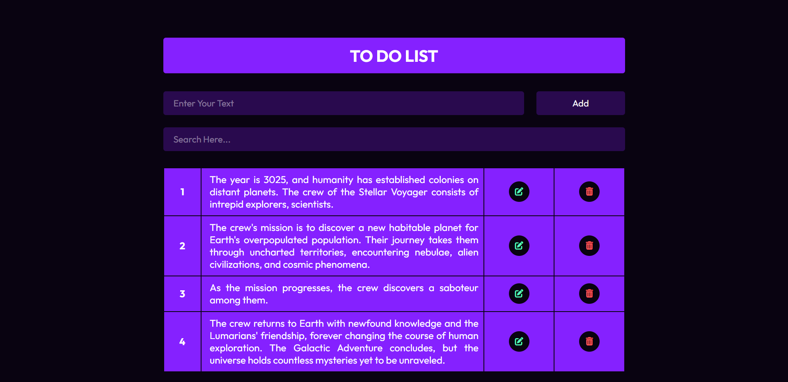

# Modern To-Do List

Welcome to the Modern To-Do List repository! This project is a JavaScript-based web application designed to manage tasks with ease. Built with HTML, CSS, and JavaScript, it features a modern UI design, supports task editing and deletion, and includes a search filter for efficient task management.

## Preview



## Features

- **Task Management:** Add, edit, and delete tasks effortlessly.
- **Modern UI Design:** Sleek layout and visually appealing design for an enjoyable user interface.
- **Search Filter:** Quickly find tasks using the search functionality.

## Getting Started

To run the Modern To-Do List locally, follow these steps:

1. Clone the repository to your local machine:

   ```bash
   git clone https://github.com/Devsethi3/Modern-Todo-List.git
   ```

2. Open the `index.html` file in your preferred web browser.

## Usage

1. Add tasks by entering the task name and clicking the "Add" button.
2. Edit tasks by clicking the pencil icon, make changes, and click the checkmark icon to save.
3. Delete tasks by clicking the trash icon next to each task.
4. Use the search bar to filter tasks based on keywords.

## Customization

Feel free to customize this project to fit your preferences. Update styles, colors, and layout in the HTML and CSS files. You can also extend the functionality to include additional features or customization options.

## Contributing

If you'd like to contribute to this project, please follow these steps:

1. Fork the repository.
2. Create a new branch for your feature or improvement.
3. Make your changes and commit them with descriptive messages.
4. Push your changes to your forked repository.
5. Open a pull request to merge your changes into the main branch.

Explore the Modern To-Do List, manage your tasks efficiently, and consider contributing to its development. Thank you for checking out the repository!